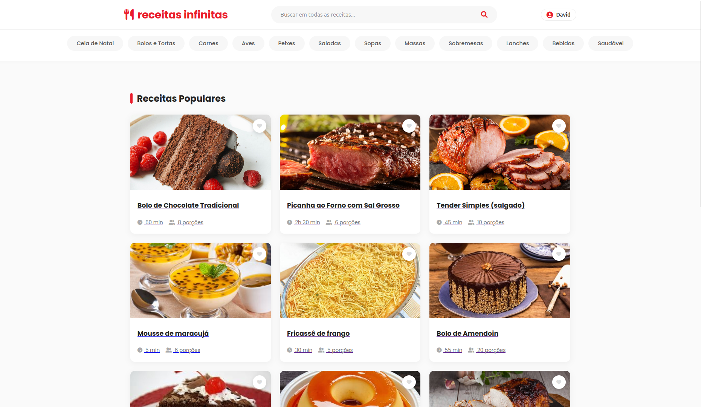
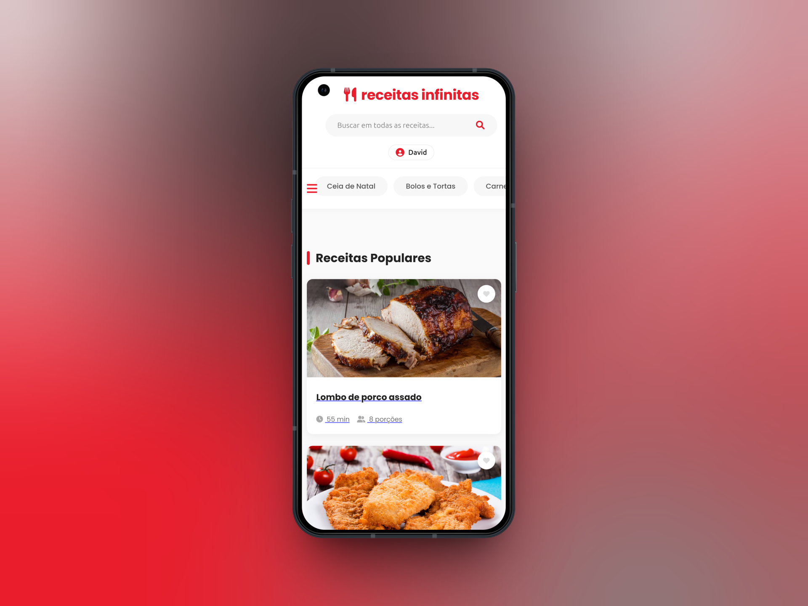
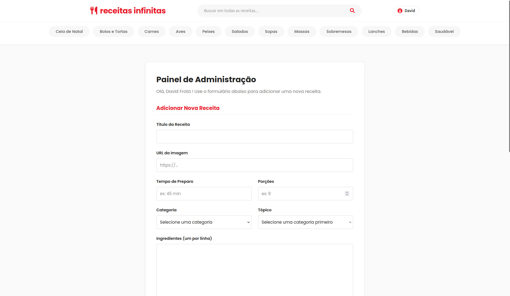
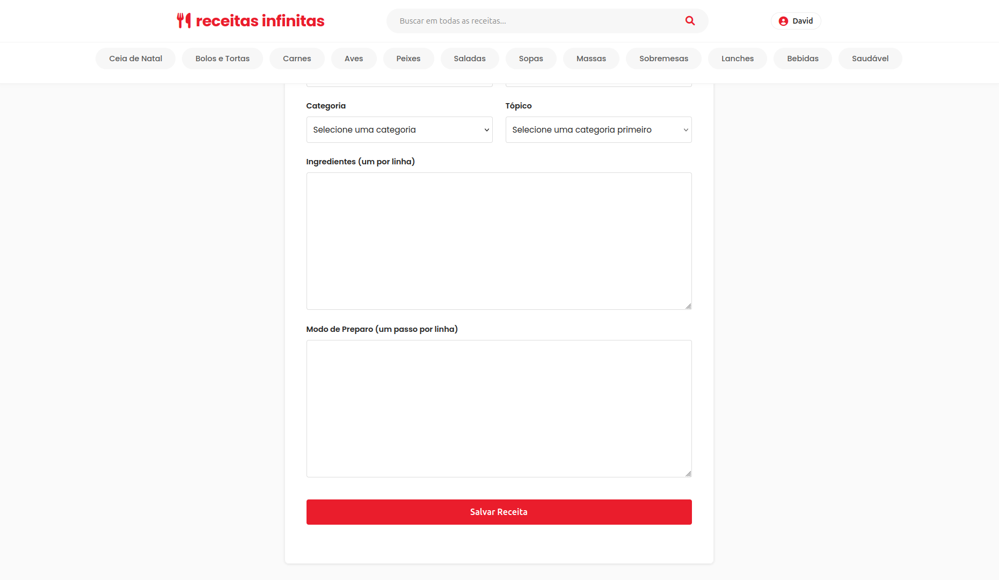

# 🍴 Receitas Infinitas

> **O seu guia definitivo de sabores.** Uma aplicação Fullstack robusta para gerenciamento e descoberta de receitas culinárias.


---

## Preview do Projeto


*(Interface moderna com navegação em estilo "Chips" e cards interativos)*

## Sobre o Projeto

O **Receitas Infinitas** é um sistema web completo desenvolvido para conectar amantes da culinária. O objetivo foi criar uma aplicação que unisse um **Backend seguro e escalável** com um **Frontend moderno e responsivo**.

Diferente de sistemas acadêmicos comuns, este projeto foca na Experiência do Usuário (UX), com animações suaves, feedback visual imediato e um design system consistente.

---

## Design Responsivo (Mobile First)

Diferente de sistemas acadêmicos comuns, este projeto foca na Experiência do Usuário (UX). O layout é fluido e funciona perfeitamente em Desktop, Tablet e Mobile.

<div align="center">
  
</div>

---

## Funcionalidades Principais

### Experiência do Usuário (Public & User)
- **Catálogo Dinâmico:** Feed de receitas com carregamento otimizado.
- **Filtro Inteligente:** Navegação por categorias (Bolos, Carnes, Saudável, etc.) com menu deslizante estilo App Mobile.
- **Busca em Tempo Real:** Pesquisa de receitas por título ou ingredientes.
- **Sistema de Favoritos:** Usuários logados podem "curtir" receitas, salvando-as em sua lista pessoal.
- **Design Responsivo:** Layout fluido que funciona perfeitamente em Desktop, Tablet e Mobile.

### Área Administrativa & Segurança
- **Autenticação JWT:** Sistema de Login e Cadastro seguro usando *JSON Web Tokens*.


*(GIF: Validação de formulário e login bem-sucedido)*

- **Controle de Acesso:** Rotas protegidas (apenas Admins acessam o painel de criação).
- **Gestão de Conteúdo:** Interface para cadastro de novas receitas com suporte a URLs de imagem.

<div align="center">
  
  
</div>
<p align="center">
  <em>(Visualização detalhada com botão de exclusão para usuários autorizados)</em>
</p>

## Tecnologias Utilizadas

### Backend (Java Ecosystem)
- **Java 21 LTS**: Linguagem base.
- **Spring Boot 3**: Framework principal.
- **Spring Security**: Gerenciamento de autenticação e autorização stateless.
- **Spring Data JPA**: Persistência de dados e abstração de SQL.
- **H2 Database**: Banco de dados em memória (facilmente migrável para MySQL/PostgreSQL).
- **Maven**: Gerenciamento de dependências.

### Frontend
- **HTML5 & CSS3 Moderno**: Uso de Flexbox, Grid Layout e Variáveis CSS para um Design System próprio.
- **JavaScript (ES6+)**: Lógica do cliente, manipulação do DOM e consumo de API REST (Fetch API).
- **Font Awesome**: Ícones vetoriais para interface visual.

## Destaques de Design e Código

- **Menu "Chips":** Navegação horizontal moderna para categorias, similar a apps de delivery.
- **Cards Interativos:** Efeito de *hover* com zoom suave nas imagens e elevação do card.
- **Data Seeder:** Script Java automático que popula o banco de dados com categorias e receitas iniciais ao rodar o projeto.
- **Arquitetura em Camadas:** Código organizado em *Controllers*, *Services*, *Repositories* e *Models*.

## Como Rodar o Projeto Localmente

### Pré-requisitos
- Java JDK 17 ou superior.
- Maven instalado.

### Passo a Passo

1. **Clone o repositório**
   ```bash
   git clone [https://github.com/davidfrott/app-receitas-infinitas.git]

2. **Entre na pasta do projeto**
   ```bash
   cd app-receitas-infinitas

3. **Configure o Banco de Dados**
   * Navegue até: `src/main/resources/`
   * Crie um arquivo chamado: `application.yaml`
   * Cole o seguinte conteúdo (alterando para os dados do seu banco PostgreSQL local):

   ```yaml
   spring:
     datasource:
       url: jdbc:postgresql://localhost:5432/receitas_db
       username: seu_usuario_postgres
       password: sua_senha_postgres
     jpa:
       hibernate:
         ddl-auto: update
       show-sql: true

4. **Execute o Backend**
   ```bash
   mvn spring-boot:run

5. **Acesse a Aplicação**
   ```bash
   Abra o seu navegador e vá para: http://localhost:8080